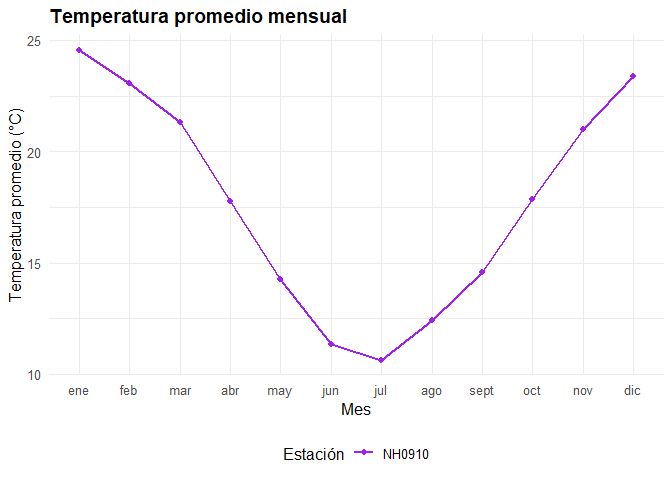

<!-- README.md is generated from README.Rmd. Please edit that file -->

# meteorologia

<!-- badges: start -->

[](https://lifecycle.r-lib.org/articles/stages.html#experimental)

<!-- badges: end -->

El objetivo de este paquete es analizar datos de estaciones
meteorologicas, resumirlos y presentarlos

## Instalación

Podes instalar el paquete en [GitHub](https://github.com/) con:

``` r
# install.packages("pak")
pak::pak("biancarossi/meteorologia")
```

## Carga paquete

Se debe cargar el paquete con el siguente código.

``` r
library(meteorologia)
```

## Funciones principales

El paquete incluye tres funciones principales:

descargar_leer_estaciones() Descarga y lee los datos meteorológicos de
una estación específica del INTA.

``` r
 estacion1 <- leer_datos_estacion("NH0910", "../estacionNH0910.csv")
#> El archivo no está descargado, se procede a descargarlo...
#> Lectura completada correctamente para la estación NH0910.
```

tabla_resumen_temperatura() Crea una tabla resumen con estadísticas
básicas de temperatura (promedio, desvío, máximos y mínimos).

``` r
tabla_resumen_temperatura(estacion1)
#> # A tibble: 1 × 5
#>   id     promedio_temperatura desvio_estandar temp_max temp_min
#>   <chr>                 <dbl>           <dbl>    <dbl>    <dbl>
#> 1 NH0910                 17.7            6.12       43     -8.5
```

grafico_temperatura_mensual() Genera un gráfico de líneas con la
temperatura promedio mensual de una o varias estaciones.

``` r
grafico_temperatura_mensual(estacion1, c("purple"), "Temperatura promedio mensual")
```



## Créditos

Datos meteorológicos obtenidos del Instituto Nacional de Tecnología
Agropecuaria (INTA) – Sistema de Información y Gestión Agropecuaria
(SIGA).

# Autores del paquete: Bianca Rossi y Liz Emilia Martinez
